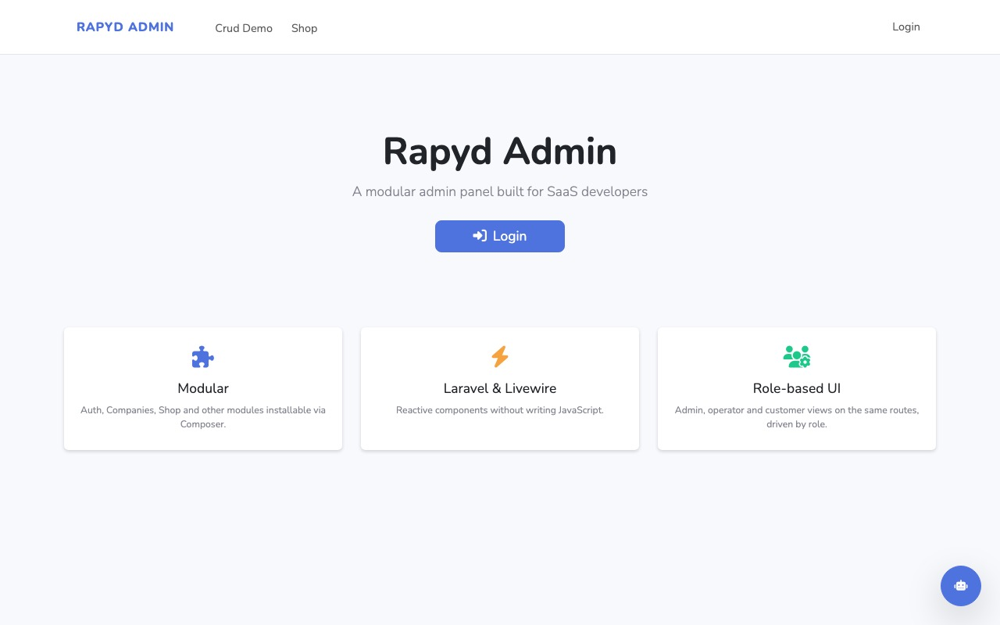

# Rapyd Admin

<a href="https://github.com/zofe/rapyd-admin/actions/workflows/run-tests.yml"></a>
<a href="https://packagist.org/packages/zofe/rapyd-admin"></a>
<a href="https://packagist.org/packages/zofe/rapyd-admin"></a>

[](https://rapyd.dev)

**Rapyd Admin** is an open-source admin panel for Laravel: a light alternative to Nova, Filament and Backpack for teams
building SaaS products, and for development with AI agents. Plain Livewire + Blade files that live in your codebase,
auth and multi-tenancy included, one command to start.

**[Live demo →](https://rapyd.dev)**

## Why Rapyd Admin

- **Plain code, no DSL.** No resource classes to learn: the generators write ordinary Livewire components and Blade views into `app/Modules`, yours to edit. A unified `x-rpd::` component set gives every table, form and detail page the same shape.
- **Built for SaaS.** Login, registration, 2FA and Google sign-in (Fortify + Socialite), roles and permissions (Spatie), multi-tenant Companies with 1–3 tiers, activity log, workflows. All bundled, all optional.
- **Agent-friendly.** Flat, self-contained module folders with consistent naming, `php artisan rpd:context` to brief an agent, and a verification loop (tests, browser) an agent can run by itself.

## Quick start

Requires PHP 8.2+, Laravel 12 or 13 and Livewire 4.

```bash
composer create-project laravel/laravel myapp && cd myapp
composer require zofe/rapyd-admin:^9 -W
php artisan rpd:make:setup     # .env, database, configs, migrations, admin user, home page
php artisan serve
```

Log in with `admin@laravel` / `admin`. You get a sidebar with Users, Companies, Roles & Permissions and Logs, a landing
page, and an `app/Modules` folder ready for your own modules.

> `-W` lets Composer downgrade Guzzle to 7 on Laravel 13: `laravel/socialite` still requires it through `league/oauth1-client`.
> Google sign-in appears on the login page as soon as `GOOGLE_CLIENT_ID` and `GOOGLE_CLIENT_SECRET` are set, see [docs/AUTH.md](docs/AUTH.md).

## What's included

| Module | What it gives you |
|---|---|
| **Auth** | Fortify login, registration, password reset, email verification, 2FA; Google sign-in; users, roles and permissions pages; impersonation |
| **Companies** | Multi-tenant company hierarchy (1–3 tiers), owner/member role, data scoping through `Limit` and `Authorize` |
| **Addresses** | Postal addresses attachable to any model, with an embeddable editor |
| **Workflow** | Symfony Workflow state machines on your models, with transition buttons and history embeds |
| **Log** | Application log viewer with error analysis by AI, and an activity log of what users do |
| **Search** | Global search box in the navbar across the models you configure |
| **Layout** | Bootstrap 5.3 admin shell (sidebar, topbar, dark mode), the reference theme |

Every module can be copied into your app with `php artisan rpd:eject Module` when you need to change it deeply.
Details in [docs/MODULES.md](docs/MODULES.md).

[](https://rapyd.dev)

## Your first module in two minutes

```bash
php artisan rpd:make Articles Article --module=Blog --fields="title,body:text,published_at:datetime"
```

creates `app/Modules/Blog` with a table, a detail page and a form for `Article`, its routes and a sidebar entry;
when the model does not exist yet it is created with its migration from `--fields`, and migrated. No prompts:

```
app/Modules/Blog/
├── Livewire/ArticlesTable.php   ArticlesView.php   ArticlesEdit.php   (authorization and scoping built in)
├── Views/articles_table.blade.php   articles_view.blade.php   articles_edit.blade.php   menu.blade.php
├── Models/Article.php           uuid key, ShortId
├── Authorizations/ArticleAuth.php   Limits/ArticleLimit.php   record check and data scoping, yours to restrict
├── config.php                   layout, menu entry, permissions (view / edit articles, given to operator)
└── routes.php                   behind auth
```

The views are short because the work is done by the components:

```html
<x-rpd::table title="Articles" :items="$items">
    <x-slot name="filters">
        <x-rpd::input col="col-8" model="search" placeholder="search..." />
    </x-slot>
    <table class="table">
        <thead><tr><th><x-rpd::sort model="id" label="id" /></th><th>title</th></tr></thead>
        <tbody>
        @foreach ($items as $article)
            <tr><td>{{ $article->id }}</td><td>{{ $article->title }}</td></tr>
        @endforeach
        </tbody>
    </table>
</x-rpd::table>
```

```html
<x-rpd::edit title="Article">
    <x-rpd::input model="article.title" label="Title" />
    <x-rpd::rich-text model="article.body" label="Body" />
</x-rpd::edit>
```

Tables, detail pages, forms, every field type and the navigation components are documented in
[docs/COMPONENTS.md](docs/COMPONENTS.md).

## Make it yours

**Colours, from `.env`, no build step** (quote the values: an unquoted `#` is a comment):

```dotenv
RAPYD_PRIMARY="#6a1c9a"        # buttons, links, active items
RAPYD_SIDEBAR_BG="#1e293b"     # optional: sidebar, topbar and content backgrounds
RAPYD_SIDEBAR_TEXT="#f8fafc"
```

**Brand**: `RAPYD_BRAND`, `RAPYD_LOGO_SIDEBAR`, `RAPYD_LOGO_LOGIN`, `RAPYD_FAVICON`, `RAPYD_CUSTOM_CSS`.
`RAPYD_THEME=<name>` activates an installed theme, `RAPYD_THEME_SWITCH=true` lets each visitor pick one from the navbar (see `docs/THEMES.md`).
`RAPYD_AUTH_LINKS=false` hides the Login / Register links of the frontend navbar (the routes stay, e.g. a public site whose login is reached from `/login`).

**A different look**: the admin shell is a theme, a folder of Blade layouts plus compiled assets activated with
`RAPYD_THEME`. Start from any Bootstrap 5 template, follow the contract in [docs/THEMES.md](docs/THEMES.md) and check
it with `php artisan rpd:theme:check`. Ready to use: [zofe/theme-tabler](https://github.com/zofe/theme-tabler), the
[Tabler](https://tabler.io) template (`composer require zofe/theme-tabler`, then `RAPYD_THEME=tabler`).

**A single view**: publish it to `resources/views/vendor/rpd` (components) or `resources/views/vendor/layout`
(layouts) and edit the copy. **A whole module**: `php artisan rpd:eject Auth`.

## Working with AI agents

```bash
php artisan rpd:context            # JSON brief: modules, routes, models, config, extension patterns
php artisan rpd:context --format=text --no-routes
```

Better: give your agents the package's own guideline and skills. With [Laravel Boost](https://laravel.com/docs/boost)
`php artisan boost:install` picks them up from the package; without Boost, `php artisan rpd:ai` writes them into
`AGENTS.md` / `CLAUDE.md` and `.claude/skills`. The guideline says how modules, `x-rpd::` components and workflows are
meant to be used; the `rapyd-module` and `rapyd-workflow` skills are the procedures an agent follows to create a
module or a state machine.

The package itself is developed this way: see [docs/AI.md](docs/AI.md) for the agent brief, the AI error analysis in
the log viewer and the browser verification loop.

## Modules and marketplace

Anything beyond the bundle is a Composer package with the same structure as a bundled module: `composer require`,
`php artisan migrate`, done. Available today: `zofe/shop-module`, `zofe/payments-module` (Stripe, GoCardless, Paddle),
`zofe/ai-module`. Premium modules and themes will be distributed through a private Composer repository for subscribers.
How to write one: [docs/MODULES.md](docs/MODULES.md).

## Testing

```bash
vendor/bin/phpunit            # in the package: PHPUnit + Orchestra Testbench, the same suite as CI
```

## Documentation

- [docs/COMPONENTS.md](docs/COMPONENTS.md) — tables, detail pages, forms, fields, navigation
- [docs/MODULES.md](docs/MODULES.md) — module structure, generators, config and menu, eject, Companies, Livewire 4 notes
- [docs/AUTH.md](docs/AUTH.md) — Fortify, Google sign-in, roles and permissions, impersonation
- [docs/THEMES.md](docs/THEMES.md) — the layout contract, design tokens, building a theme
- [docs/LOCALIZATION.md](docs/LOCALIZATION.md) — languages: `RAPYD_LOCALES`, URL prefixes, `Lang/{locale}.json`, `rpd:lang`
- [docs/AI.md](docs/AI.md) — `rpd:context`, AI error analysis, verification loop
- [CHANGELOG.md](CHANGELOG.md)

## Credits

- [Felice Ostuni](https://github.com/zofe)
- [All Contributors](../../contributors)

## License

MIT — [http://opensource.org/licenses/MIT](http://opensource.org/licenses/MIT)
